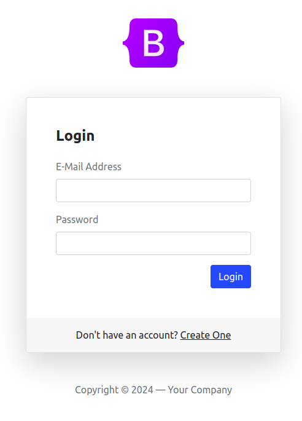
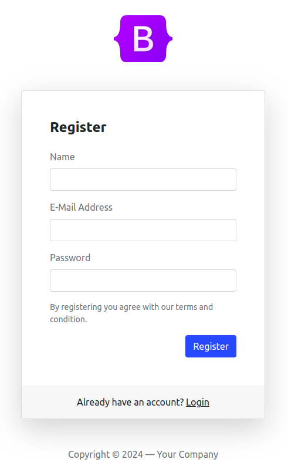
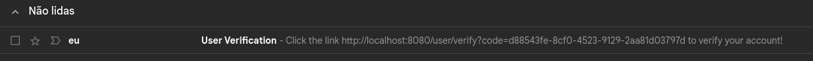

# 👤 User Register

Simple user registration and authentication

## 📝 Features

- [x] Register user
- [x] Login

## 👾 Demo





## ❓ How to Use

### ✋ Prerequisites

Before starting, you will need to have the following tools installed on your machine:
[Git](https://git-scm.com), [JDK 17](https://openjdk.org/projects/jdk/17/), [Maven](https://maven.apache.org/), [Postgres](https://www.postgresql.org/). 
Furthermore, it is good to have an editor to work with the code like [VSCode](https://code.visualstudio.com/)

### 🚀 Running

```bash
# Clone this repository
git clone https://github.com/alvesluis0/user-register

# Access the project folder in terminal/cmd
cd user-register
```

Modify the environment variables in the
[application.properties](/src/main/resources/application.properties) file to their respective values

```bash
spring.datasource.url=jdbc:${DB_URL}
spring.datasource.username=${DB_USERNAME}
spring.datasource.password=${DB_PASSWORD}
spring.mail.username=${MAIL_USERNAME}
spring.mail.password=${MAIL_PASSWORD}

# For example
spring.datasource.url=jdbc:postgresql://localhost:5432/user_register
spring.datasource.username=user
spring.datasource.password=strong-password
spring.mail.username=example@gmail.com
spring.mail.password=asda qwer uiop zxcv vbnm
```

```bash
# Install the application
mvn package

# Run the application
java -jar target/user-register

# The server will start on port:8080 - access <http://localhost:8080/login> to test
```

## 🛠 Technologies

The following tools were used to build the project:

- [Java 17](https://openjdk.org/projects/jdk/17/)
- [Maven](https://maven.apache.org/)
- [Postgres](https://www.postgresql.org/)
- [Spring Boot](https://spring.io/)
- [Java Mail Sender](https://www.baeldung.com/spring-email)
- [JWT.IO](https://jwt.io/)

## 🔖 Learnings

- Password encryption
- Account activation via email
- JWT generation and user recovery by token